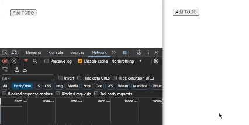
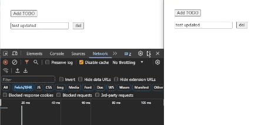

# Exploring Conflict-free Replicated Data Types (CRDT) with Hybrid Logical Clocks (HLC)

### Instructions

1. Clone this project.

2. Run `npm ci`

3. Start the server:

```bash
node ./server.js
```

4. Open `index.html` in a web browser.

### Demo





### References

- [An Interactive Intro to CRDTs](https://jakelazaroff.com/words/an-interactive-intro-to-crdts/)
- [Building a Collaborative Pixel Art Editor with CRDTs](https://jakelazaroff.com/words/building-a-collaborative-pixel-art-editor-with-crdts/)
- [A CRDT Primer Part II: Convergent CRDTs](https://blog.jtfmumm.com//2015/11/24/crdt-primer-2-convergent-crdts/)
- [Eventual Consistency and Conflict Resolution - Part 2](https://www.mydistributed.systems/2022/02/eventual-consistency-part-2.html)
- [Making CRDTs 98% More Efficient](https://jakelazaroff.com/words/making-crdts-98-percent-more-efficient)
- [CRDTs: The Hard Parts (video)](https://www.youtube.com/watch?v=x7drE24geUw&t=3587s)
- [Distributed Systems 4.1: Logical time (video)](https://www.youtube.com/watch?v=x-D8iFU1d-o)
